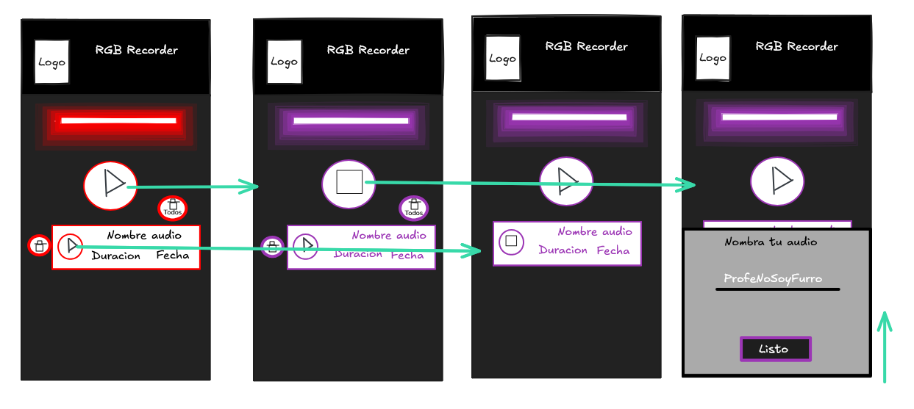

# 01 - Diseño en Excalidraw

Este documento describe el diseño inicial de la aplicación PGL-SoundRecorder realizado en Excalidraw.

## Colores

- Colores: negro(#000), blanco(#FFF) y grises(#222222 y #AAAAAA). 
- Todos los demas colores para el arcoiris de los efectos de neón RGB.

## Boceto hecho en excalidraw

